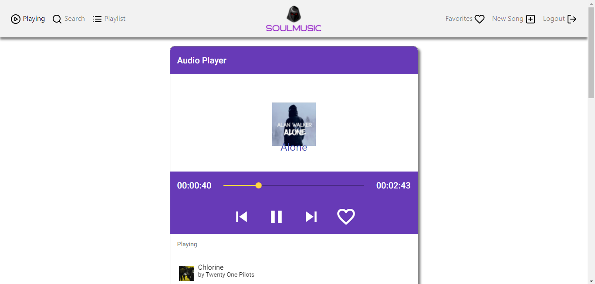

# MusicProject
Hands-on project with Angular and firebase to create a music website

## Screenshots
&nbsp;&nbsp;&nbsp;&nbsp;
&nbsp;&nbsp;&nbsp;&nbsp;

## How to use

Run "npm install" inside this project folder to install all dependencies.

Make sure you use the latest version of the CLI (upgrade guide below)

Run "ng serve" to see the app in action (try "npm start" in case "ng serve" fails).

Feel free to compare it with your project code to spot any errors you might have.

## How to upgrade the CLI

Run the below commands - only use "sudo" on Mac/ Linux.

sudo npm uninstall -g angular-cli @angular/cli
npm cache clean --force
sudo npm install -g @angular/cli
